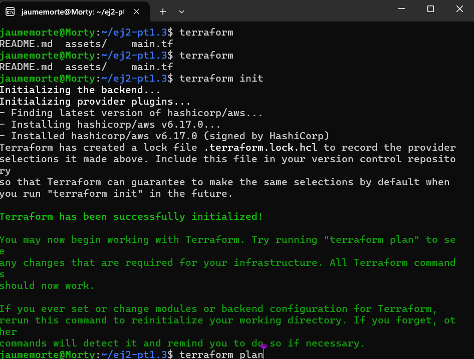
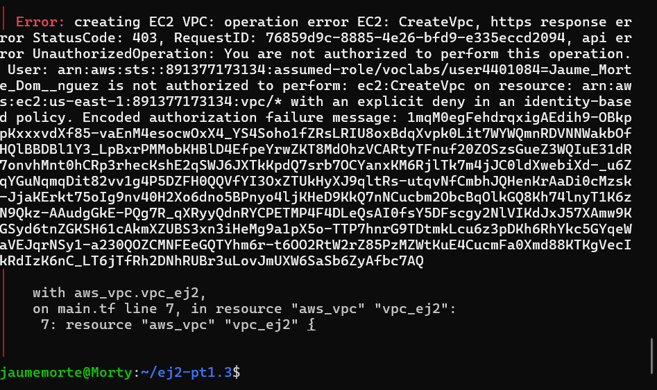
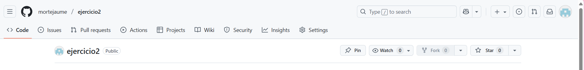

Este ejercicio consta de crear 1 VPC, que dentro de esta, habran 3 subredes. Cada subrec tendrá 2 instancias de aws a traves de Terraform. 

Primero he creado la estructura que se nos pide con mkdir, que es la siguiente:
/pt1.3-ej2/main.tf
/pt1.3-ej2/assets/images
/pt1.3-ej2/README.md

En el archivo main.tf he introducido las instrucciones para crear lo que se nos pide

Seguidamente dentro del ultimo directorio, he realizado el comando terraform init para iniciar el proceso y que nos de el visto de bueno de poder seguir adelante.

Despues he utilizado el comando terraform plan para saber que es lo que esta realizando el archivo main.tf

Una vez esté todo de acuerdo aplicamos, utilizando terraform apply.

Me sale el error conforme no tengo permisos para crear una VPC, pero en teoria tendria que funcionar.

Y la topologia utilizando Lucidchart es esta:

Seguidamente subimos el repositorio a github. Previamente lo crearemos en GitHub.

Una vez creado el repositorio, lo subiremos a GitHub con los siguientes comandos:
git remote add origin https://github.com/mortejaume/terraform-ejercicio1.git
git branch -M main
git push -u origin main
